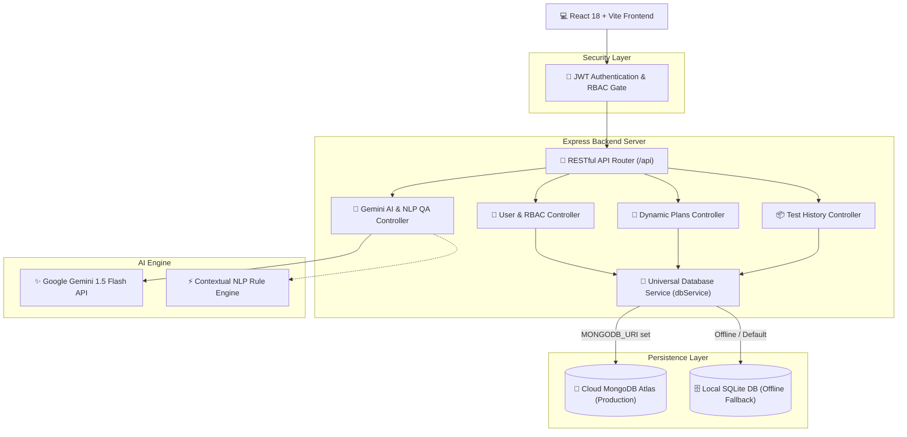

# 🤖 AI-Powered Software Test Case Generator & QA Suite

<div align="center">


<p align="center">
  <strong>An Intelligent, Enterprise-Grade QA Platform that Synthesizes Professional Software Test Cases from Natural Language Requirements using Google Gemini AI, Hybrid Cloud Persistence, and Role-Based Access Control.</strong>
</p>

[Explore Features](#-features--highlights) •
[Quick Start](#-quick-start-guide) •
[Architecture](#-system-architecture) •
[Database & Cloud](#-hybrid-cloud-database-architecture) •
[API Documentation](#-rest-api-specifications) •
[Demo Accounts](#-live-demo-accounts)

</div>

---

## 🌟 Overview

The **AI-Powered Test Case Generator** bridges the gap between software specifications and production-ready quality assurance. Powered by **Google Gemini 1.5 Flash** and an intelligent **Natural Language QA Rule Engine**, it converts raw User Stories, Feature Descriptions, and API specs into structured Positive, Negative, and Boundary limit test suites with automated export to **Excel**, **Landscape PDF**, **CSV**, and **JSON**.

Engineered with a **Hybrid Cloud Architecture**, the system seamlessly synchronizes data with **MongoDB Atlas** for live cloud deployment while maintaining an offline-first **SQLite** edge engine with zero downtime.

---

## ✨ Features & Highlights

### 🧠 1. Intelligent AI Test Synthesis
- **Google Gemini 1.5 Flash Integration**: Real-time generative test suite synthesis with automated prompt engineering.
- **Contextual NLP Fallback Engine**: Proprietary natural-language parsing rules that synthesize tailored test cases even when offline or without an API key.
- **Triple-Coverage Generation**: Every test suite systematically generates:
  - 🟢 **Positive (Happy Path)** scenarios
  - 🔴 **Negative (Error Handling & Security)** scenarios
  - 🟡 **Boundary Condition (Threshold Capacity)** scenarios

### 🗄️ 2. Hybrid Cloud & Offline Database
- **Cloud MongoDB Atlas Ready**: Pre-configured Mongoose ODM schemas for production deployment (Render, Vercel, Railway).
- **SQLite Edge Fallback**: Automatic local database (`aitestgen.db`) with zero setup required.
- **1-Click Cloud Migration**: Single command (`npm run db:migrate-mongo`) ports all users, suites, plans, and telemetry from SQLite to MongoDB Atlas.

### 🔐 3. Role-Based Access Control (RBAC) & Security
- **JWT Session Management**: Signed JSON Web Tokens with stateless verification.
- **Bcrypt Password Encryption**: Industry-standard cryptographic hashing for all credentials.
- **Dual-Dashboard Redirection**: Automatic role differentiation:
  - `Admin` ➔ Dedicated **Administrative Governance Portal** (`/admin`)
  - `QA Engineer / User` ➔ **Main Generator & Analytics Dashboard** (`/dashboard`)
- **Route Protection**: HTTP 401 Unauthorized and 403 Forbidden interceptors on both frontend and backend.

### 📊 4. Executive Admin Portal & Telemetry
- **User Governance**: Provision new users, toggle account statuses (Active/Suspended), modify plans, and adjust generation quotas.
- **System Telemetry**: Real-time memory usage (Heap MB), server uptime, active user breakdown, and operational audit trail.

### 📑 5. Multi-Format Export Pipelines
- **Landscape PDF Reports**: Print-ready, executive QA summary reports formatted via `jspdf` and `jspdf-autotable`.
- **Excel Workbooks (.xlsx)**: Formatted spreadsheets generated client-side via SheetJS.
- **CSV & JSON**: Standardized formats for direct integration with JIRA, TestRail, and Azure DevOps.

---

## 🏛️ System Architecture



---

## 🔑 Live Demo Accounts

The database comes pre-seeded with role-based accounts ready for demonstrations:

| Role | Email | Password | Permissions | Target Dashboard |
| :--- | :--- | :--- | :--- | :--- |
| 🛡️ **Administrator** | `admin@rku.ac.in` | `Admin@123` | Full User Governance, Telemetry, Unlimited Quota | `/admin` Portal |
| 🧪 **Lead QA Engineer** | `rutvik.shiyal@rku.ac.in` | `User@123` | AI Generation, Test Suite History, Export Tools | `/dashboard` |
| 👨‍💻 **QA Analyst** | `rahul.kanzariya@rku.ac.in` | `User@123` | Pro QA Plan, JIRA Export Access | `/dashboard` |

---

## 🚀 Quick Start Guide

### Prerequisites
- [Node.js](https://nodejs.org/) (v18.x or v20.x recommended)
- Git

### 1. Clone the Repository
```bash
git clone https://github.com/SYL-Rutvik/AI-testcase.git
cd AI-testcase
```

### 2. Backend Setup
```bash
cd backend

# Install dependencies
npm install

# (Optional) Copy environment template
cp .env.example .env

# Start the Express server
npm start
```
> Server starts on **`http://localhost:5000`** with dynamic database hydration.

### 3. Frontend Setup
```bash
# Open a new terminal
cd frontend

# Install dependencies
npm install

# Start Vite development server
npm run dev
```
> Client opens instantly at **`http://localhost:5173`**.

---

## 🗄️ Hybrid Cloud Database Architecture

This project solves the deployment challenge by implementing a **Universal Database Repository (`dbService.js`)**:

```text
backend/
├── db/
│   ├── database.js          # SQLite connection, tables & seeds
│   ├── mongo.js             # MongoDB Atlas connection & auto-seeding
│   └── dbService.js         # Universal DB Adapter (Dual-Mode routing)
├── models/                  # Mongoose ODM Schemas
│   ├── User.js              # User credentials & RBAC roles
│   ├── PricingPlan.js       # Dynamic subscription tiers
│   ├── PresetTemplate.js    # Requirement prompt templates
│   ├── TestSuite.js         # Saved test suite metadata
│   ├── TestCase.js          # Individual test steps and data
│   └── AuditTelemetry.js    # System security and event logs
└── scripts/
    ├── viewDb.js            # CLI SQLite table inspection tool
    └── migrateToMongo.js    # 1-Click SQLite -> MongoDB Atlas migration
```

### Useful Database Commands

```bash
# Inspect local SQLite tables and rows in terminal
npm run db:view

# Migrate all SQLite data to Cloud MongoDB Atlas
npm run db:migrate-mongo
```

---

## 📡 REST API Specifications

| Method | Endpoint | Access | Description |
| :--- | :--- | :--- | :--- |
| `POST` | `/api/generate-test-cases` | Public / Token | Synthesizes test cases via Gemini AI / NLP |
| `POST` | `/api/auth/login` | Public | Authenticates credentials and returns JWT token |
| `POST` | `/api/auth/register` | Public | Creates new user account with 10 free generations |
| `POST` | `/api/auth/google` | Public | Google OAuth 2.0 token exchange |
| `GET` | `/api/auth/me` | Authenticated | Retrieves current logged-in user profile |
| `GET` | `/api/plans` | Public | Fetches dynamic subscription plans |
| `POST` | `/api/plans/upgrade` | Authenticated | In-app subscription plan upgrade |
| `POST` | `/api/plans/reset-credits`| Authenticated | Resets demo generation quota to 0 |
| `GET` | `/api/presets` | Public | Fetches dynamic requirement templates |
| `GET` | `/api/history` | Authenticated | Fetches saved test suites with child test cases |
| `POST` | `/api/history` | Authenticated | Saves newly generated test suite to database |
| `DELETE`| `/api/history/:id` | Authenticated | Removes a test suite and its test cases |
| `GET` | `/api/admin/users` | Admin Only | Administrative user list & status management |
| `POST` | `/api/admin/users` | Admin Only | Provisions a new user account |
| `PATCH`| `/api/admin/users/:id` | Admin Only | Updates user role, plan, status, or quota |
| `DELETE`| `/api/admin/users/:id`| Admin Only | Permanently removes user account |
| `GET` | `/api/admin/telemetry` | Admin Only | System metrics, heap memory, and audit trail |
| `GET` | `/health` | Public | System and active database health check |

---

## 📦 Tech Stack

- **Frontend**: React 18, Vite, Tailwind CSS, Lucide React, jsPDF, SheetJS (xlsx), Canvas-Confetti
- **Backend**: Node.js, Express.js, Google Generative AI SDK (`@google/generative-ai`), Mongoose, SQLite3, BcryptJS, JSONWebToken, CORS, Dotenv
- **Databases**: MongoDB Atlas (Cloud M0 Cluster) + SQLite (Embedded Local Engine)
- **Deployment Targets**: Render, Vercel, Railway, AWS

---

## 🎓 Academic Defense & Viva Highlights

When presenting this project for university evaluation or technical interviews, highlight:
1. **Resilient AI Pipeline**: The system gracefully handles Gemini API quota limits by automatically falling back to the contextual NLP QA rule engine.
2. **Repository Design Pattern**: Controllers never write raw SQL or MongoDB queries directly; all operations route through `dbService.js`.
3. **Defense-in-Depth RBAC**: Route guarding is implemented at both the React Router level and Express middleware level with cryptographic JWT verification.
4. **Cloud Migration Automation**: Demonstrating `npm run db:migrate-mongo` showcases real-world DevOps data pipeline engineering.

---

## 📄 License

This project is licensed under the **MIT License** - open for educational and commercial development.

<div align="center">
  <sub>Built with ❤️ by <strong>Rutvik Shiyal</strong> for Advanced AI-Powered Quality Assurance.</sub>
</div>
